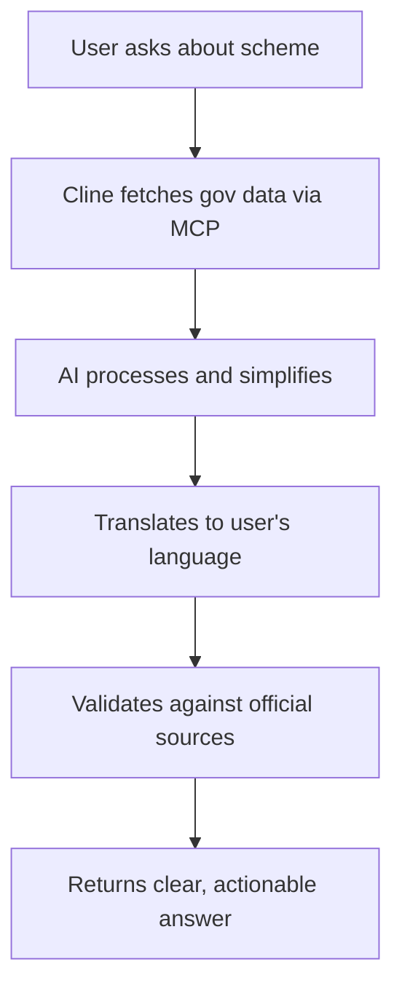

# 🚀 Getting the Best Out of Cline - Hackathon Guide

> **Hackathon Focus**: Building powerful autonomous coding workflows and meaningful capabilities on top of Cline

This guide covers the most powerful features of Cline to help you win the hackathon by building autonomous coding workflows.

---

## 📋 Table of Contents

1. [Core Features Overview](#core-features-overview)
2. [MCP (Model Context Protocol) - The Killer Feature](#mcp-model-context-protocol---the-killer-feature)
3. [CLI Workflow Automation](#cli-workflow-automation)
4. [Context Management Best Practices](#context-management-best-practices)
5. [Browser Automation](#browser-automation)
6. [Advanced Tips & Tricks](#advanced-tips--tricks)
7. [CivicLens-Specific Ideas](#civiclens-specific-ideas)

---

## 🎯 Core Features Overview

### What Makes Cline Special

| Feature | Description | Hackathon Value |
|---------|-------------|-----------------|
| **MCP Servers** | Create custom tools that extend Cline's capabilities | ⭐⭐⭐⭐⭐ |
| **CLI Integration** | Execute terminal commands with real-time feedback | ⭐⭐⭐⭐ |
| **Browser Automation** | Visual debugging and testing | ⭐⭐⭐⭐ |
| **Context Management** | Efficiently handle large codebases | ⭐⭐⭐⭐ |
| **Plan & Act Mode** | Strategic planning before execution | ⭐⭐⭐⭐ |

---

## 🔧 MCP (Model Context Protocol) - The Killer Feature

MCP is what makes Cline truly powerful. You can create custom tools that Cline can use autonomously!

### How to Create an MCP Server

Simply ask Cline:
```
"Add a tool that fetches government scheme data from data.gov.in API"
```

Cline will automatically:
1. Create the MCP server code
2. Configure it in your settings
3. Make it available for future tasks

### MCP Server Ideas for CivicLens 🏛️

1. **Government Data Fetcher**
   ```
   "Add a tool that fetches scheme eligibility criteria from government APIs"
   ```

2. **Document Parser**
   ```
   "Add a tool that parses PDF documents and extracts eligibility requirements"
   ```

3. **Language Translator**
   ```
   "Add a tool that translates responses to regional Indian languages"
   ```

4. **Database Query Tool**
   ```
   "Add a tool that queries the CivicLens database for common questions"
   ```

5. **Notification Sender**
   ```
   "Add a tool that sends webhook notifications when new schemes are added"
   ```

### MCP Server Template

Here's what an MCP server looks like (Cline creates these for you):

```typescript
// Example: Government Scheme Fetcher MCP Server
import { Server } from "@modelcontextprotocol/sdk/server/index.js";
import { StdioServerTransport } from "@modelcontextprotocol/sdk/server/stdio.js";

const server = new Server({
  name: "civiclens-gov-data",
  version: "1.0.0",
}, {
  capabilities: {
    tools: {},
  },
});

server.setRequestHandler("tools/list", async () => ({
  tools: [{
    name: "fetch_scheme_data",
    description: "Fetch government scheme data by category",
    inputSchema: {
      type: "object",
      properties: {
        category: { type: "string", description: "Scheme category (health, education, pension)" },
        state: { type: "string", description: "Indian state name" }
      },
      required: ["category"]
    }
  }]
}));

// Tool implementation...
```

---

## ⚡ CLI Workflow Automation

### Autonomous Workflows You Can Build

1. **Continuous Integration Workflow**
   ```
   Ask Cline: "Run tests, fix any failures, and deploy if all pass"
   ```

2. **Database Migration Workflow**
   ```
   Ask Cline: "Create a migration for adding a new 'schemes' table with fields for name, eligibility, and documents"
   ```

3. **API Development Workflow**
   ```
   Ask Cline: "Create a REST API endpoint for /api/schemes that supports filtering by category and state"
   ```

### CLI Commands Cline Handles Well

```bash
# Development
npm run dev                    # Start dev server
npm run build                  # Build for production
npm run lint -- --fix         # Auto-fix linting issues

# Database
npx prisma migrate dev        # Run migrations
npx prisma generate           # Generate client
npx prisma studio             # Open database GUI

# Git Operations
git status && git add . && git commit -m "message"
git push origin main

# Testing
npm test                       # Run test suite
npm run test:coverage         # With coverage report
```

### "Proceed While Running" Feature

For long-running commands like `npm run dev`, Cline can:
- Start the dev server
- Continue working on other files
- React to compilation errors in real-time

---

## 🧠 Context Management Best Practices

### Using @ Mentions Effectively

| Mention | Use Case | Example |
|---------|----------|---------|
| `@file` | Include specific file | `@app/api/chats/route.ts help me add error handling` |
| `@folder` | Include entire folder | `@components/app fix all TypeScript errors` |
| `@url` | Fetch documentation | `@https://nextjs.org/docs/app/api-reference add proper API routes` |
| `@problems` | Fix workspace issues | `@problems fix all warnings and errors` |

### Context Window Optimization

1. **Be Specific**: Instead of "fix the app", say "fix the authentication flow in app/(app)/chats/page.tsx"

2. **Use Checkpoints**: Cline creates snapshots - use "Compare" and "Restore" to test different approaches

3. **Break Down Tasks**: Large tasks should be split:
   ```
   ❌ "Build the entire CivicLens backend"
   ✅ "Create the API endpoint for fetching scheme eligibility"
   ```

### Cline Memory Bank

Create a `.clinerules` file for project-specific instructions:

```markdown
# CivicLens Project Rules

## Tech Stack
- Next.js 14 with App Router
- Prisma with PostgreSQL
- Clerk for authentication
- Tailwind CSS for styling

## Coding Standards
- Use TypeScript strict mode
- Follow React Server Components best practices
- All API routes should have proper error handling
- Use Zod for input validation

## Project Context
CivicLens helps citizens understand government schemes.
Focus on clarity and accessibility in all responses.
```

---

## 🌐 Browser Automation

### When to Use Browser Actions

1. **Visual Testing**
   ```
   Ask Cline: "Test the chat interface and verify messages display correctly"
   ```

2. **E2E Testing**
   ```
   Ask Cline: "Test the complete flow: login → ask question → receive answer"
   ```

3. **Screenshot Documentation**
   ```
   Ask Cline: "Take screenshots of all main pages for documentation"
   ```

4. **Debug Runtime Errors**
   ```
   Ask Cline: "Launch the app and check for any console errors"
   ```

### Browser Automation Flow

```
1. Cline runs `npm run dev`
2. Launches headless browser at localhost:3000
3. Performs interactions (click, type, scroll)
4. Captures screenshots and console logs
5. Reports findings and fixes issues
```

---

## 🎯 Advanced Tips & Tricks

### 1. Plan & Act Mode

Switch to **Plan Mode** for complex tasks:
- Discuss approach before coding
- Review architecture decisions
- Get approval before making changes

### 2. YOLO Mode (For Hackathons!)

Enable auto-approve for faster iteration:
- Great for rapid prototyping
- Use with caution in production

### 3. Hooks

Set up hooks for automated actions:
```json
{
  "onSave": "npm run lint",
  "onFileChange": ["*.tsx", "npm run type-check"]
}
```

### 4. Slash Commands

| Command | Action |
|---------|--------|
| `/new` | Start fresh conversation |
| `/clear` | Clear context |
| `/reportbug` | Report Cline issues |

### 5. Multi-Root Workspace

Cline understands monorepos - organize your hackathon project:
```
civiclens/
├── apps/
│   ├── web/          # Next.js frontend
│   └── api/          # Backend API
├── packages/
│   ├── ui/           # Shared components
│   └── database/     # Prisma schema
└── mcp-servers/      # Custom MCP tools
```

---

## 🏛️ CivicLens-Specific Ideas

### Autonomous Workflows for Your Hackathon

1. **Auto-Documentation Generator**
   ```
   "Create an MCP tool that generates user documentation from code comments"
   ```

2. **Scheme Data Pipeline**
   ```
   "Build a workflow that:
    1. Scrapes government websites for new schemes
    2. Parses the data
    3. Updates the database
    4. Notifies users of new schemes"
   ```

3. **Multilingual Support**
   ```
   "Add a tool that automatically translates responses to Hindi, Tamil, Bengali, etc."
   ```

4. **Accessibility Checker**
   ```
   "Create a tool that audits pages for WCAG compliance"
   ```

5. **AI Response Validator**
   ```
   "Build a tool that fact-checks AI responses against official government sources"
   ```

### Example Hackathon Submission Flow



---

## 📚 Quick Reference

### Keyboard Shortcuts

| Action | Shortcut |
|--------|----------|
| Open Cline | `Cmd+Shift+P` → "Cline: Open" |
| New Task | `Cmd+Shift+P` → "Cline: New Task" |
| Toggle Plan/Act | Click mode toggle in Cline panel |

### Useful Prompts for CivicLens

```
1. "Analyze the codebase and suggest improvements for accessibility"

2. "Create an API endpoint that integrates with India's Open Government Data Platform"

3. "Add comprehensive error handling to all API routes"

4. "Set up automated testing for the chat functionality"

5. "Create an MCP server that validates user eligibility for schemes"

6. "Implement caching for frequently asked questions"

7. "Add rate limiting to prevent API abuse"

8. "Create a feedback collection system for AI responses"
```

---

## 🏆 Hackathon Winning Strategy

### Day 1: Foundation
- [ ] Set up MCP servers for government data integration
- [ ] Create `.clinerules` file with project context
- [ ] Build core API endpoints with Cline's help

### Day 2: Features
- [ ] Implement multilingual support via MCP tool
- [ ] Add browser automation for E2E testing
- [ ] Build autonomous documentation generator

### Day 3: Polish
- [ ] Use Cline to fix all linting/type errors
- [ ] Run browser tests for visual QA
- [ ] Generate demo screenshots and documentation

---

## 📖 Additional Resources

- [Cline Documentation](https://docs.cline.bot)
- [MCP Protocol Specification](https://modelcontextprotocol.io)
- [Cline CLI Reference](https://docs.cline.bot/cli/reference)
- [Community Discord](https://discord.gg/cline)
- [GitHub Repository](https://github.com/cline/cline)

---

**Remember**: The hackathon prizes the best use of Cline CLI for autonomous workflows. Focus on:
1. **MCP Servers** - Custom tools that extend capabilities
2. **Workflow Automation** - Multi-step autonomous tasks
3. **Real-world Impact** - CivicLens helps real citizens!

Good luck! 🎉
